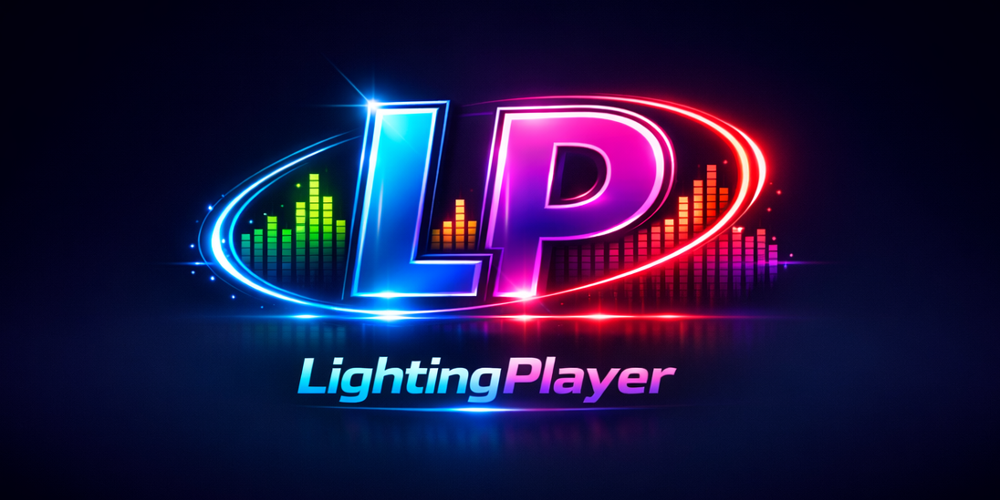



# LightingPlayer
**Author: Y.Komori**  
**Initial Release: 2026-05-05**

音楽に合わせて PC の RGB を動かしたくて色々探しましたが、ちょうどいいアプリが見つかりませんでした。  
「無いなら作るか。」  
そう思って作り始めたのが LightingPlayer です。

LightingPlayer の「プレイヤー」は音楽プレイヤーではなく、**ARGB ライティングのプレイヤー**という意味です。  
・・・ちなみに音楽プレイヤー機能は“飾り”です。開発環境では動きましたが、実際に動くかどうかは運しだいです。

LightingPlayer は、音声に合わせて ARGB ライティングを制御する Windows アプリケーションです。

**OpenRGB が認識したコントローラに属するデバイスなら基本的に光ります。**  
マザーボードでも、LED ストリップでも、ゲームパッド（PS用含む）でも、OpenRGB が拾った瞬間に LightingPlayer の制御対象になります。
※ OpenRGB が LED 数を正しく認識していない場合、そのデバイスは光りません。

さらに、LightingPlayer は **OpenRGB が認識する限界まで LED を増設できます。**  
LED 本数が増えるほど表現力も上がりますが、**限界を目指す場合は PC 側のマシンパワーが必要**になります。
本気で限界構成を試した報告をいただければ、作者がとても喜びます。

OpenRGB 本体以外はすべて独自実装で作りました。  
音声解析と発光モードには、かなりこだわっています。

------------------------------------------------------------

## 用語（この README での表記）

- **コントローラ**: OpenRGB 上の内部制御単位（モード適用先）
- **デバイス**: 実際の物理機器（マザーボード、LED ストリップ等）

------------------------------------------------------------

## LightingPlayer は “光の遊び場” です

LightingPlayer には、音に合わせて色が変わるだけではなく、  
**LED の中で小さなショーが始まるような発光モード** がいくつもあります。

- 音に合わせて **色が気まぐれに変わる** ランダム  
- 中心から光が脈打つ **リアクティブパルス**  
- LED の上を光がスーッと走って戻る **スキャナー**  
- 帯状の光がぐるっと一周する **サイクル**  
- 国別パトカー？が巡回する **パトロール**  
- 白熱電球のように揺らぎながら灯る **クリスマス**  
- コントローラ内蔵アニメをそのまま踊らせる **デバイスモード**

音に合わせて光るだけではなく、  
**“光の動きそのものを楽しむ”** アプリです。

------------------------------------------------------------

## 動作環境

- Windows 10 以降
- .NET 10
- OpenRGB 対応デバイス、または Dynamic Lighting 対応デバイス

------------------------------------------------------------

## 使い方

### システム音声を使う場合（再生中のアプリの音に合わせて光らせたい場合）

1. `LightingPlayer.exe` を起動します。
2. メインウィンドウの「システム音声を解析」にチェックが入っていることを確認します（デフォルトでオン）。
   - 初回起動（`app-settings.json` が存在しない状態）では、音声解析の各帯域（低域/中域/高域/平均）はオフで開始します。必要に応じてオンにしてください。
3. 「ライティング制御を開く」を押します。
4. 必要に応じてメイン画面の「制御ゾーン選択」から、OpenRGB で制御するゾーンを選びます。
5. 制御方式で **OpenRGB** または **Dynamic Lighting** を選択します。
6. 「ライティングに接続」を押します。
7. 同期パターンや色などのパラメーターをお好みで調整します。
8. 接続が完了すると、PC の再生音に合わせて光が動きます。

### 音楽ファイルを使う場合

1. `LightingPlayer.exe` を起動します。
2. メインウィンドウの「システム音声を解析」のチェックを外します。
3. 「プレイヤーを開く」を押してプレイヤーウィンドウを開きます。
4. 「ファイルを開く」または「フォルダを開く」から音声ファイルを読み込みます。
5. 「ライティング制御を開く」を押します。
6. 必要に応じてメイン画面の「制御ゾーン選択」から、OpenRGB で制御するゾーンを選びます。
7. 制御方式で **OpenRGB** または **Dynamic Lighting** を選択します。
8. 「ライティングに接続」を押します。
9. 同期パターンや色などのパラメーターをお好みで調整します。
10. 再生すると音楽に合わせて光が動きます。

------------------------------------------------------------

## ゾーン別独立制御（OpenRGB 接続時）

OpenRGB から取得した各ゾーンに対して、  
**パターン・FPS・カラーをゾーンごとに独立設定できます。**

### 基本仕様
- **制御ゾーン選択** で発光対象ゾーンを選択  
- 空名・不可視名のゾーンは自動除外  
- ゾーンを 1 つ以上選択すると、そのゾーンの LED のみ発光  
- 未選択時は OpenRGB が認識した全 LED が対象  
  - ※OpenRGB 側で光らないゾーンはそのまま光りません  
- 選択状態は保存され、次回起動時に自動復元

### 制御スコープ
- **一括**：全ゾーンへ同じ設定を適用  
- **個別**：ゾーンごとに別設定を適用  
- **デバイスモード**：OpenRGB 対応コントローラの内蔵モードを使用

### 個別制御の動作
- **制御先ドロップダウン** は “設定対象の切り替え専用”  
  - 選択しただけではプレビューも通常動作も切り替わらない  
- 設定画面を開いている間だけ、そのゾーンをプレビュー  
- 設定画面  
  - **適用**：その場で確定  
  - **閉じる**：最後に適用した状態を保持  
- LED が 1 個のゾーンでは、移動系エフェクト（スキャナー等）は自動的に非表示

### デバイスモード（OpenRGB）
- コントローラごとに  
  - モード一覧  
  - 色設定  
  - 更新  
  を操作可能  
- モード名・色設定は **コントローラ単位で保存**  
- 一括/個別の設定画面を開閉しても、デバイスモードの色設定は上書きされない  
- 起動時は保存済みモードを復元し、復元完了後に自動適用

> **注意**：ゾーン別制御は OpenRGB 接続時のみ有効です。  
> Dynamic Lighting ではゾーン単位の制御は行えません。

------------------------------------------------------------

## 発光モード

### ランダム

音の大きさに合わせて色がランダムに変わります。  
「全LED一括」または「LEDごとランダム」の 2 パターンを選べます（OpenRGB 接続時のみ「LEDごとランダム」が有効）。  
音が大きいほど明るく光り、音が小さいと暗くなります。

### リアクティブパルス

音の大きさに合わせて、ゾーンの中心から外側へ向かって LED が点灯します。
反応した音の強さに応じて、広がり方と明るさがなめらかに変化します。
無音や閾値未満へ移行した場合も、いきなり消えずに自然に減衰します。
設定画面では、最終的な発光の強さを決める **光量アッテネータ** と、
反応入力レベルの効きを調整する **入力アッテネータ** を個別に調整できます。
色は「ランダム」または「固定色」から選択できます。  
Dynamic Lighting 接続時は一括での色変更として動作します。

### スキャナー

知る人ぞ知る、あの車のアレです。どうやら “あの車” と違って、ロックが流れても回路がショートしそうにはならないようです。
光の点が左右へ往復し続け、音の大きさに応じてスキャン速度と明るさが変化します。  
無音時は片道 4 秒で移動し、折り返し時はいったん端で停止してから反転します。  
残光（トレイル）は移動方向の後ろ側だけに残り、白熱球のように徐々に暗くなりながら消えます。  
速度・待機輝度はスキャナー専用設定から調整できます。  
色は「単色（デフォルト: 赤）」または「ランダム」から選択できます。  
Dynamic Lighting 接続時は単色またはランダム色の切替として動作します。

>スキャナーモードでは感度・帯域重み（低域/中域/高域/平均）が反映されます。

### サイクル

全 ARGB LED を 1 本の仮想ゾーンとして扱い、先頭の光が帯状に循環するモードです。  
移動方向は「+方向」または「-方向」を選択でき、1 周時間（`1〜10秒`）を調整できます。  
色は「単色」または「ランダム（8 / 64 / 512 色パレット）」を選択できます。

>サイクルモードでは感度・帯域重み（低域/中域/高域/平均）は使用されません。

### パトロール

パトロール演出を模したシーン型アニメーションモードです。  
国設定（`JP` / `US`）に応じて発光シーケンスが切り替わります。  
OpenRGB では仮想 LED フレームをそのまま投影し、Dynamic Lighting では代表色でフォールバック表示します。

>パトロールモードでは感度・帯域重み（低域/中域/高域/平均）は使用されません。

### クリスマス

全 ARGB LED を 1 本の仮想ゾーンとして扱い、白熱電球風のフェードで点灯するモードです。  
LED は 20 個単位を基準に分散グループ化され、各グループ内で 30% を抽選点灯します。  
点灯周期（3 秒 ±1 秒）と抽選周期（5 秒 ±1 秒）は独立しており、点灯中 LED の再当選は消灯まで無視されます。  
色は共通 8 色パレットを利用し、黒・白を除いた 6 色から、同時点灯した LED 1 本ごとに個別でランダム抽選されます。
50FPS以上の設定を推奨します。

>クリスマスモードでは感度・帯域重み（低域/中域/高域/平均）は使用されません。

### デバイスモード（OpenRGB）

OpenRGB 対応コントローラが内蔵する標準モード（レインボー、カラーサイクル、点滅など）を使用します。  
コントローラ自体がアニメーションを実行するため、音声解析のパラメーターは使用されません。  
ライティング制御画面で **制御スコープ** を「デバイスモード」に切り替えると、同じ画面内でコントローラと利用可能なモードを選択できます。  
モード一覧にはコントローラ番号、モード ID、モード名、色指定対応状況を表示します。  
色指定に対応したモードでは、モード一覧の下に **モード色設定** が表示され、カラーピッカーで色を設定できます。  
色指定時は OpenRGB のモード色設定に合わせてモード固有色を送信します。  
選択したモード名とモード色はコントローラごとに保存され、同じコントローラへ戻ると保存済み設定を復元します。  
一括制御 / 個別制御の設定画面で別スコープを編集しても、デバイスモード専用のモード色設定は別保存のため上書きされません。  
選択したモードは、そのモードが属するコントローラにのみ適用されます。
デバイスモードを適用したコントローラは、別のエフェクトが明示的に設定されるまで通常エフェクト送信の対象から外れます。

> **補足**: 一部コントローラでは、`Wave` 系モードから通常エフェクトへ戻る際に、エフェクト適用の主導権が切り替わらない固有挙動を確認しています。このため、現行実装では `Wave` 系モード離脱時に一度 `Wave` モード以外へ退避してから通常エフェクトへ復帰します。その際にちらつきが発生することがあります。

> **注意**: デバイスモードは OpenRGB 接続時のみ有効です。コントローラによって利用できるモードが異なります。コントローラからモード名を取得できなかった場合、無効化され表示されません。

------------------------------------------------------------

## 制御方式について

### OpenRGB モード

OpenRGB を使って、マザーボードの RGB / ARGB ヘッダーや OpenRGB が認識できるコントローラを制御できます。  
リアクティブパルスや スキャナー などのエフェクトを最大限に活かせます。
動作可否は OpenRGB 側の対応状況と、OpenRGB SDK Server からコントローラ・ゾーン情報を取得できるかに依存します。取得できたゾーンは、おおむね制御対象として利用できます。ただし、名前が空、または不可視文字のみのゾーンは存在しないものとして扱います。

### Dynamic Lighting モード

Windows 標準のライティング機能（Dynamic Lighting）を使って制御します。  
デバイスの LED を一括で制御するシンプルなモードです。  
メーカーやデバイスによって動作が異なる場合があります。

### 接続とサーバ設定

- OpenRGB サーバに接続できない場合は、自動的に Dynamic Lighting への接続を試行します。
- OpenRGB / Dynamic Lighting のどちらにも接続できない場合は、警告を表示し、アプリは終了せず RGB 出力を抑制します。
- メイン画面の「サーバ設定」右側には、現在接続中の OpenRGB サーバ、または「未接続」を表示します。
- サーバ設定は、設定ウィンドウを閉じた時点でまとめて反映されます。変更がない場合は再接続しません。
- サーバ設定が変わった場合は、現在の接続を切断し、変更後のサーバへ再接続します。

### 音声解析について

LightingPlayer は、単純に音量へ反応して明るさを変えるだけではなく、
音の変化を低域 / 中域 / 高域ごとに捉えながら、各発光モードが使いやすい形へ自動調整してライティングへ反映します。

音声解析画面に表示される高域 / 中域 / 低域レベルは、見やすさと反応の安定性を重視して調整した表示用レベルです。

これにより、以下のような特性を実現しています。
- 音の大小だけでなく、帯域ごとの変化も反映
- 閾値調整なしでも安定して反応
- 急な変化を抑えた、見やすく自然な動き
- 発光モードごとの個性を活かした反応

------------------------------------------------------------

## FAQ（よくある質問）

### **Q. 音量に合わせて光っているだけですか？**  
いいえ。FFT による帯域分析と独自正規化を行い、音の構造を反映した内部レベルを生成しています。

### **Q. OpenRGB を入れれば自動で光りますか？**  
GUI で Zone Size（LED 数）を設定して保存する必要があります。  
Zone Size が 0 のままだと光りません。

### **Q. Dynamic Lighting でもゾーン別制御できますか？**  
できません。ゾーン別・LED 別の細かい制御は OpenRGB 接続時のみ利用できます。

### **Q. デバイスモードと音声解析は同時に使えますか？**  
使えません。デバイスモードはコントローラ側でアニメーションを実行するため、音声解析は適用されません。

### **Q. 初回起動時にデバイスモードが選べないことがあります**  
設定ファイルがない状態で起動した場合、制御スコープは一括で開始します。さらに OpenRGB コントローラ未検出時はデバイスモードへ切り替わらないため、OpenRGB 接続後にコントローラが検出されてから選択してください。

### **Q. RGB デバイスはどこまで対応していますか？**  
OpenRGB 側の対応状況に依存します。OpenRGB SDK Server からコントローラ・ゾーン情報を取得できた場合、その範囲はおおむね制御対象として利用できます。

### **Q. 音声解析画面の数値は dB 値ですか？**  
いいえ。FFT の生値ではなく、LightingPlayer 独自の内部ロジックで再計算された制御専用の値です。

### **Q. プレビュー時は音声同期が必要ですか？**  
エフェクトによって異なります。スキャナー・サイクル・パトロール・クリスマスはタイマー駆動のため、音声同期なしで動作します。リアクティブパルス・ランダムは音声解析が必要です。

### **Q. OpenRGB の既存プロセスに必ず接続されますか？**  
同梱の `OpenRGB.exe` を優先して接続します。  
既存プロセスが別バージョンの場合、接続されないことがあります。

### **Q. OpenRGB から取得したコントローラ・ゾーン構成を確認できますか？**  
確認できます。OpenRGB 接続時に取得した構成データは、解析直前の可読形式で `logs/openrgb/openrgb-readable-configuration.log` に保存されます。  
このログは実行ごとに上書きされ、 `openrgb.log` も同様に保存されます。

------------------------------------------------------------

## OpenRGB モードを使用する前に

OpenRGB モードを使用するには、事前に OpenRGB（GUI）で初期設定が必要です。

1. OpenRGB を GUI モードで起動します。
2. 各コントローラの LED 数（Zone Size）を正しく設定します。
3. 設定後に「Save and Close」で保存します。
4. Windows の Dynamic Lighting（動的ライティング）をすべて OFF にします。

> **LED 数が 0 のままだと光りません。** 必ず Zone Size を設定してから保存してください。

------------------------------------------------------------

## OpenRGB モードで光らない場合のチェックリスト

- [ ] OpenRGB を GUI で起動して LED 数（Zone Size）を設定・保存した  
- [ ] OpenRGB.exe がバックグラウンドで起動している  
- [ ] Windows の Dynamic Lighting をすべて OFF にした  
- [ ] OpenRGB の SDK Server が「Running」になっている  
- [ ] 他の RGB ソフト（iCUE / Aura Sync / Mystic Light など）が起動していない  
- [ ] USB ハブや延長ケーブルを使用している場合は、PC に直接挿してみる  

------------------------------------------------------------

## 配布パッケージの内容

- `LightingPlayer.exe`
- `OpenRGB.exe`（同梱）
- 必要な DLL / 設定ファイル
- `License/Notice.txt`（OpenRGB ライセンス通知）

------------------------------------------------------------
## ライセンス（LightingPlayer）

LightingPlayer は個人開発のフリーソフトです。  
商用・非商用を問わず自由に利用できます。

本アプリケーションは OpenRGB を同梱していますが、LightingPlayer 自体は GPL ではなく、独立したアプリケーションとして提供されています。

開発はすべて個人の時間で行っています。  
もし LightingPlayer があなたの環境を少しでも楽しくしたり、「これは良い」と思っていただけたなら、寄付で応援してもらえると嬉しいです。

**商用での調整やカスタマイズをご希望の場合は、別途ご相談ください（有償）。**

------------------------------------------------------------

## 免責事項

- 本ソフトウェアは無保証です。
- 使用により発生したいかなる損害についても、作者は責任を負いません。
- ご利用はすべて自己責任でお願いします。
- 予告なく仕様変更・更新停止する場合があります。
- 再配布は自由ですが、ファイル構成を変更しないこと・作者を偽らないことを条件とします。
- 商用利用は可能ですが、必要に応じて各自で検証してください。
- `OpenRGB.exe` は GPLv2 に基づき同梱しています。

------------------------------------------------------------

## ライセンス通知（OpenRGB）

### OpenRGB License Notice (Bundled with This Application)

This application includes the OpenRGB executable (OpenRGB.exe) to enable advanced RGB device control.
OpenRGB is licensed under the GNU General Public License version 2 (GPLv2).

OpenRGB is provided as an external, standalone program. It is not linked with this application, and no part of its source code is incorporated into this application.
Communication is performed exclusively through an independently developed, protocol‑compatible client implementation over TCP to the OpenRGB SDK Server, which does not constitute a derivative work under the GPLv2.

In accordance with the GPLv2, the complete source code for OpenRGB is available at:https://gitlab.com/CalcProgrammer1/OpenRGB

### OpenRGB ライセンス通知（本アプリに同梱されています）

本アプリケーションは、高度な RGB デバイス制御を行うためにOpenRGB の実行ファイル（OpenRGB.exe）を同梱しています。
OpenRGB は GNU General Public License version 2（GPLv2）の下で提供されています。

OpenRGB は外部の独立したプログラムとして同梱されており、本アプリケーションとリンクされていません。
また、OpenRGB のソースコードが本アプリケーションに組み込まれることもありません。
通信は TCP を用いて OpenRGB SDK Server に対して行われる、独自に開発されたプロトコル互換クライアント実装を通じてのみ実施されるため、GPLv2 における「派生物」には該当しません。

GPLv2 に基づき、OpenRGB の完全なソースコードは以下から入手できます：https://gitlab.com/CalcProgrammer1/OpenRGB

------------------------------------------------------------

## 更新履歴

詳細な更新履歴は [CHANGELOG.md](./CHANGELOG.md) を参照してください。

- **2026/05/03**
  - 個別制御の実行対象とプレビュー開始条件を修正し、設定対象選択と実行対象の挙動を分離。
  - 初回起動時の既定値適用、OpenRGB 未検出時のフォールバック、設定リセット後の再同期、起動時エラー表示抑制を改善。

- **2026/05/02**
  - デバイスモード復元まわり（保存済みモード優先、色設定保持、復元順序）を中心に安定性を改善。
  - `Direct` / ダイレクト系モードをデバイスモード候補へ追加。

- **2026/05/01**
  - 制御スコープに「デバイスモード」を追加し、同画面でコントローラ選択・モード適用・色設定に対応。
  - 制御ゾーン選択、接続フォールバック、接続状態表示など運用性を強化。

- **2026/04/28 〜 2026/04/22**
  - ゾーン別設定 UI の統合（適用/閉じる挙動の明確化）、リアクティブパルス/スキャナー調整、クリスマスモード追加、音声解析連動の改善を実施。
